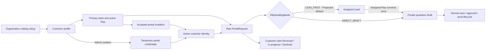
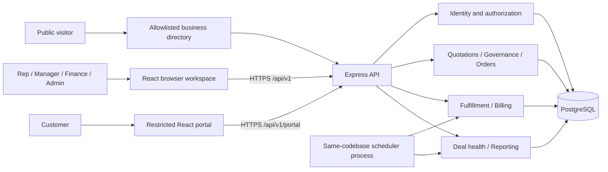
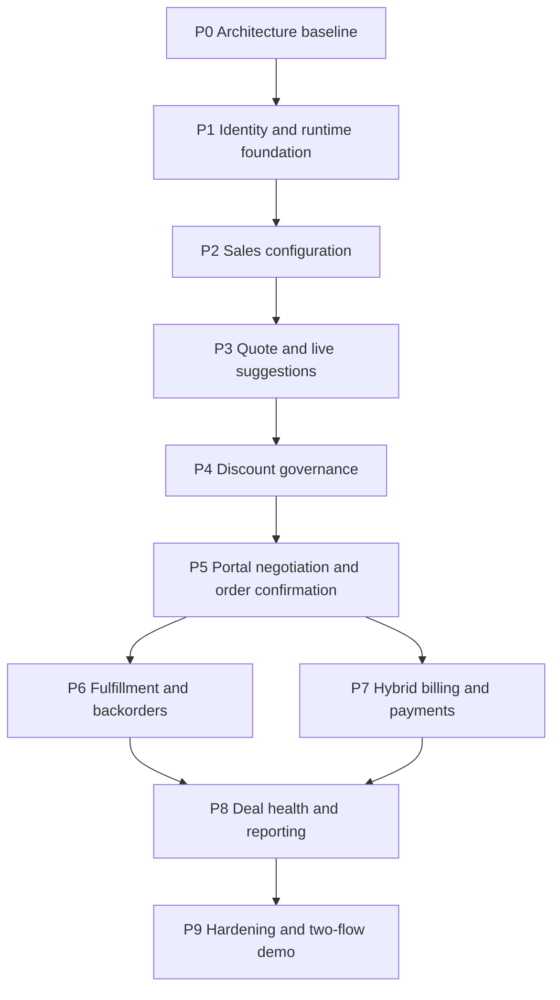

# DealOS — Architecture baseline

Status: living architecture contract with a functional React/Express/Prisma slice implemented locally. Sections describing the larger quotation-to-cash model remain target architecture; current implementation and limitations are recorded in `memory.me`.

## 1. Problem Interpretation

DealOS coordinates B2B quotation preparation, discount review, negotiation, warehouse fulfillment and mixed billing. The root issue is disconnected commercial and operational state. Reps, reviewers, operations and customers need one traceable deal history. A working solution must enforce the rules while users move between screens. See the ten-point interpretation and evidence precedence in [PRD.md](PRD.md).

## 2. Confirmed / Inferred / Proposed Requirements

The R-001–R-051 register in [PRD.md](PRD.md#requirements-classification) is authoritative for classification. Confirmed capabilities come from the PDF, 18-screen board and the user's subsequent phase directions. Versioning, reservations and idempotency are inferred correctness needs. Session mechanism, aggregate risk formula, the 14-day initial invoice term and deployment are proposed technical decisions. Proposed decisions remain marked when implemented; new requirements need an entry rather than a silent addition.

## 3. Actors and Stakeholders

Five organization roles are explicit: Sales Rep, Sales Manager, Finance/Operations, Customer and Admin. The independent Platform Owner is a separate environment-authenticated actor, not a sixth organization role. The [actor matrix](Domain.md#actor-matrix) specifies decisions, information visibility and restrictions. A scheduler is a noninteractive system actor, not an account with a reusable password.

## 4. Core Workflows

W-01 Identity; W-01A Public directory and customer association; W-02 Configuration; W-03 Quotation and suggestions; W-04 Approval; W-05 Negotiation/acceptance; W-06 Fulfillment; W-07 Hybrid billing; W-08 Payment; W-09 Deal health; W-10 Reporting. [Domain.md](Domain.md#workflow-definitions) records trigger, actor, input, logic, database effects, outputs, failure and recovery for each.

Commercial execution order: draft → evaluated submitted revision → required review → customer review and possible revision → matching approval and acceptance → order → allocation/dispatch and billing → payment. The board's screen ordering is not interpreted as permission to dispatch before customer agreement.

## 5. Domain Model

Quotation is the stable deal; revision is the commercial snapshot. Approval and acceptance reference a revision. Order copies approved/accepted terms. Reservation is a stock promise; shipment is physical consumption. Subscription is a recurring obligation; invoice is an issued receivable; payment is recorded settlement evidence. [Domain.md](Domain.md) freezes this language. Avoid generic CRUD models and one-table-per-screen designs.

## 6. Business Rules

BR-001–BR-028 in [Domain.md](Domain.md#numbered-business-rules) cover calculation, combined discounts, effective caps, risk, revisions, reviewer independence, confirmation, isolation, stock, splitting, consolidation, cadence, proration, credits, idempotency, payments, audit, alerts, suggestions, exports, customer relationships, portal onboarding, portal RFQ processing, Admin-provisioned initial customer access and approval-gated public association. Each rule has owner/workflow/edge cases. A rule change requires updated examples, tests, API effects and migration assessment.

## 7. Capability Map

```text
DealOS
├── Identity and role activation
├── Public organization discovery
│   └── Association request and Manager/Admin decision
├── Sales backend configuration
│   ├── Customers, tiers, teams and product variants
│   ├── Price lists and versioned approval policies
│   └── Warehouses, stock and subscription plans
├── Quotation preparation
│   ├── Pricing, discounts and cadence-specific margin
│   └── Cross-sell / upsell suggestions
├── Customer portal intake
│   ├── Raw quotation requests and customer-safe status
│   └── Admin-selected Lead-first or Direct-draft processing
├── Discount governance
│   └── Ordered review and audit
├── Customer negotiation
│   └── Revision-bound acceptance and order confirmation
├── Fulfillment
│   └── Reservation, split, shipment and backorder consolidation
├── Hybrid billing
│   └── Recurring periods, proration, invoices, payments and credits
├── Deal health
│   └── Rule-based alerts and internal nudges
└── Reporting and exports
```

The earlier source-diagram annotation “Future portal intake” / “GAP / OPTIONAL EXTENSION” is superseded by the implemented v1 flow below. The branch choice is explicit organization configuration, not an inferred default:



No chatbot, social messaging, mobile application or unrelated analytics platform is included. A public marketing landing page was explicitly added by the user on 2026-09-05.

## 8. Architecture Goals

1. Correct money, stock and authorization transitions under retries and concurrent requests.
2. Traceability from source requirement to workflow, rule, API and screen.
3. Pragmatic module ownership; one deployment and one PostgreSQL transaction boundary.
4. Clear customer/internal security boundary and revocable identity.
5. Testable pure calculations separated from I/O.
6. Reproducible setup and explicit phase gates; no fake completion or mock persistence.
7. Operationally modest design with safe room to grow.

Initial performance targets are proposed, not sourced: paginated lists default 25/max 100; quote preview normally under 500 ms on representative seeded workloads; normal list/detail reads under 1 s. Measure on documented hardware before claiming these targets are met. No unsupported scale or availability promise.

## 9. Full System Architecture

### Architectural style and system context

A modular monolith fits tightly transactional quote/order/stock/billing operations and the small development scope. Microservices would introduce distributed consistency without a demonstrated need. Browser users communicate with Express; PostgreSQL is authoritative. Google Identity Services is the only configured external identity provider and is limited to public signup; the first release needs no carrier, payment gateway, model API or email service.



### Data flow

UI event → feature query/mutation hook → typed service → REST request → security/validation → controller → application service → domain calculator/policy → repository → PostgreSQL. Controller returns an explicit DTO; errors become standard envelopes. Committed mutation invalidates affected frontend query keys. Polling refreshes approvals/stock/health; no WebSockets are needed initially.

### Integrations and deployment

Proposed production shape: TLS reverse proxy serves frontend static assets and proxies `/api/v1` to one Express service. API and optional scheduler share code, database and migration history. PostgreSQL resides on a private network with TLS/verified certificates as appropriate. Database credentials are deployment secrets. The supplied Compose file provisions **local PostgreSQL only**, never deploys the application.

Scheduler leases work from PostgreSQL using `FOR UPDATE SKIP LOCKED` or advisory lock for singleton scans. Due billing has unique period keys independent of job leases. External delivery/gateway adapters are future scope; internal nudges and recorded payments must not claim external delivery or transfer.

## 10. Backend Architecture

### Boundaries and ownership

| Module | Owns / public functions | Does not own | Dependencies / entities | Routes | Rules and security |
|---|---|---|---|---|---|
| identity | signup, activateUser, login, logout, authenticate, authorizeScope; team membership reads | Commercial rules or customer-assignment writes | users, roles, teams, sessions | `/auth`, `/admin/users`, `/admin/teams`, `/sales-teams` | BR-008/021/024/027; hash passwords; scoped identities |
| directory | public allowlisted profile/list/request; scoped review and decision orchestration | Multi-business identity, catalog exposure, independent customer/assignment rules | OrganizationProfile, DirectoryJoinRequest; calls catalog relationship and identity credential services in caller transaction | `/directory`, `/settings/directory-profile` | BR-008/017/021/024/027/028; public allowlist, tenant decisions, one-time password response |
| catalog | customers, customerRelationship assignment service, products/variants, price lists, plan/policy configuration publication | Historical Quote rewrites, billing execution | tiers, customers, CustomerRepresentative history, products, prices, plan/policy versions | `/customers`, `/catalog`, `/settings` | BR-001/003/017/024/027; Manager/Admin assignment boundary |
| quotations | shared createDraft with server-derived customer relationship snapshot, preview, revise, submit, send, getScopedQuote | CustomerRepresentative writes, raw portal-request mutation, approval decisions, stock or invoice posting | catalog relationship reads, governance evaluator; quotes/revisions/lines | `/quotations` | BR-001–005/012/017/024/026; portal and Lead paths reuse this service rather than cloning price/ownership rules |
| governance | evaluateRisk, openCase, decideStep, createReturnedDraft | Editing customer terms outside the explicit returned-revision transition | identity, immutable quote snapshot; policy/cases/steps | `/approvals` | BR-003–006; Manager-first, no self-approval |
| recommendations | rankSuggestions, dismissSuggestion | Mutating quotes or inventing costs | catalog, quote calculator, order history | quote suggestions + `/settings/recommendations` | BR-019; customer-safe isolation |
| portal | issue/inspect/accept/revoke invitation, submit/list PortalRequest, safe request catalog/status, projectQuote, comment, propose, accept | Direct price mutation, internal DTO serialization, email delivery | identity/account scope; OrganizationInvitation, PortalRequest/lines, quotes/proposals/acceptances; quotation/order services | `/portal`, customer invitation actions | BR-005/007/008/025/026; every lookup customer-scoped; current assignment revalidated on submit |
| leads (small portal-intake surface) | list/get scoped Leads, convert once, reasoned dismiss; Admin RFQ mode update | Qualification scoring/stages, independent pricing or ownership rules | PortalRequest; shared quotations.createDraft; recipient Alert and AuditEvent | `/leads`, `/settings/rfq-handling` | BR-017/021/024/026; Rep-own and managed-team scope; setting Admin-only |
| orders | confirmEligibleRevision, snapshotOrder | Reviewer decisions, actual dispatch | quote/governance/acceptance reads; orders/lines | `/orders` | BR-007/015/017; transaction orchestrator |
| fulfillment | previewSplit, reserve, override, receiveStock, consolidate; ship remains the next phase | Price/approval or invoice rules | immutable OrderLines; warehouses, balances, receipt movements, reservations, backorders | `/fulfillment`, `/warehouses` | BR-009–011/015; Finance/Admin write; `FULFILLED` currently means reservation-complete only |
| billing | createConfirmationBilling, changeSubscription, recordPayment, reversePayment, requestInvoiceDueDateChange | Moving real money through a provider; recurring-period scheduling/proration until separately approved | accepted Order snapshots; subscriptions/change history/invoices/notes/payments | `/subscriptions`, `/invoices` | BR-012–016/017; Finance/Admin write |
| deal-health | evaluateAlerts, nudge, acknowledge, resolve | Repricing deals or external delivery claims | scoped quote/order reads; alerts, notifications/jobs | `/deal-health`, `/notifications` | BR-018; scoped alerts |
| reporting | aggregateSales, exportReport | Financial mutations or duplicate canonical totals | read-only scoped repositories | `/reports` | BR-020; export scope/limits |

`shared/audit`, `shared/errors`, request IDs, decimal/date utilities and idempotency helpers are cross-cutting infrastructure, not domain modules. Do not build a generic workflow engine for this finite process.

### Module dependency rules

- Only an owning repository writes its tables. Services expose operations; other modules do not import route/controller internals.
- Pure quote pricing and governance evaluation accept snapshots and return results; they perform no database writes.
- Application orchestration lives in services. Order confirmation receives a transaction context and coordinates snapshot/acceptance uniqueness plus the combined first invoice and recurring-line subscription setup atomically. Fulfillment remains a separate downstream transaction. Future recurring-period invoices remain scheduler-owned and are not disguised as part of confirmation.
- Repositories accept a Prisma transaction client for atomic cross-module workflows; they never open hidden nested transactions.
- Portal RFQ processing is synchronous in one database transaction. The portal service persists the raw request, calls the narrow shared `quotations.createDraft` boundary only when required, links the resulting Lead/Quote, creates the recipient Alert and writes audit/idempotency before commit. There is no queue or external email side effect to reconcile in v1.
- Directory approval is a narrow transaction orchestrator: it locks the PENDING tenant request, calls `customers.createCustomerProfile`, the transaction-aware customer-relationship operation and the existing password provisioning boundary, then marks the request APPROVED. Directory submission itself never creates Customer/User/Lead/Quote state.
- Audit writes participate in the caller transaction. Optional asynchronous side effects are represented as durable jobs after canonical state is persisted.
- Avoid circular services: portal invokes order confirmation; orders reads quote/approval/acceptance through repositories or narrow interfaces, never invokes portal.

### Responsibilities

Routes declare HTTP wiring and required permission. Validators parse body/query/params. Controllers translate DTOs, services orchestrate and enforce rules, pure domain functions calculate, repositories own queries, migrations own database constraints. Exceptions carry domain codes; HTTP mapping belongs in middleware. Avoid one giant router and avoid seven empty files per module.

### Observability

Structured JSON logs: timestamp, level, request ID, route, status, duration and safe actor/resource IDs. Exclude passwords, cookies, tokens, full customer comments and request bodies. Audit history is separate from diagnostic logs. `/health/live` checks process; `/health/ready` checks DB connectivity and expected migration baseline. Track failed jobs, pending-approval age, reservation conflicts and overdue billing. Graceful shutdown stops accepting requests and releases job leases after transactions finish.

## 11. PostgreSQL Architecture

Prisma is the proposed ORM; PostgreSQL remains the only business datastore. [Database.md](Database.md) specifies tables, typed fields, ownership, relationships, constraints, indexes, transactions and deletion. Fixed-precision numeric fields, `timestamptz`, foreign keys, immutable submitted snapshots and uniqueness constraints are mandatory. Advanced check/partial-index/locking constraints can use reviewed SQL migrations; ORM convenience must not weaken integrity.

Do not maintain authoritative totals in browser storage. Query caching is ephemeral. Database migrations are committed and applied separately from API startup. Twenty-six migrations currently implement the functional subset described in [Database.md](Database.md#current-database-state); the larger baseline remains a target contract.

## 12. REST API Architecture

[API.md](API.md) is the proposed complete endpoint contract inventory. Prefix `/api/v1`. Workflow mutations use explicit actions such as submit, decision, accept, allocation and record-payment. Money is string-encoded decimal. Pagination uses bounded cursor/limit; dates use ISO formats. Response envelopes are consistent, and safe DTOs differ between internal and portal views.

Optimistic concurrency uses `expectedVersion` on edits/state transitions; stale writes receive `409 STALE_VERSION`. Critical operations require `Idempotency-Key` scoped to actor, operation and resource, with payload-hash comparison. Repositories enforce ownership before returning existence details. Frontend requests never supply trusted roles, costs or approval results.

Customer account assignment is an optimistic catalog aggregate. `customer-relationships.ts` is the sole runtime writer for CustomerRepresentative history and writes its before/after privileged audit in the same transaction. Quotation creation reads that aggregate but writes only quotation-owned records. This preserves the catalog/quotation boundary and prevents account reassignment from mutating historical or open deals.

Public directory approval reuses that boundary rather than writing representative rows directly. `customers.ts` owns the reusable CAT-02 profile creation operation; `directory.ts` locks the tenant-scoped request and supplies one shared Prisma transaction to customer creation, password provisioning and `updateCustomerRelationshipsInTransaction`. `User.customerId` and the user's organization membership remain singular: discovery never turns a portal identity into a platform-wide account that can join multiple organizations.

## 13. Frontend Architecture

React/TypeScript with Vite as proposed build tool; React Router for route/state and TanStack Query for server-state coordination. These dependencies are planned, not installed yet. HTML5 and authored CSS3 provide the design system; no global state library, chart package or animation framework without a concrete need.

Feature ownership: `identity`, `quotations` (including its small Lead inbox), `approvals`, `fulfillment`, `billing`, `portal` (including request form/history), `deal-health`, `catalog`, `reporting`. Layouts own internal navigation versus customer shell. Shared components own accessible fields, dialogs, tables, badges and state panels; domain features own the calculations shown and workflows invoked.

| State | Owner | Example |
|---|---|---|
| Server | Query cache | Quote snapshot, inventory and approval case |
| Route | URL/search params | Quote ID, pipeline stage, report filters |
| Identity | `/auth/me` query and permission helpers | Visible navigation; never security authority |
| Draft form | Feature/component state | Unsaved quantities and comments |
| View preference | Optional device-local preference only | List versus pipeline; no business persistence |
| Transient UI | Component state | Modal open, focused row, validation message |

API calls reside in `services/http.ts` and feature services/hooks, not scattered effects. Cancel obsolete preview requests and ignore out-of-order responses. Financial mutations pessimistically await the authoritative result. Draft dirty-state prompts prevent accidental loss; successful mutations invalidate related list/detail/health queries. No mock-service fallback when API fails.

## 14. Screen / UX Architecture

[Design.md](Design.md) maps all 18 reference screens, additional required setup surfaces, actors, routes, data/API needs and loading/empty/success/error/permission/responsive states. The board is a functional wireframe. Proposed visual language is a calm operational ledger: warm neutral backgrounds, graphite text, restrained teal action color, amber review and red exceptions. Blue navigation in the reference is not treated as a branding requirement.

Keep exception reason, financial cadence and next action visible. Customer shell excludes internal navigation and internal financial metrics. Charts are optional representations of actual report data, never decorative invented series. Responsive browser layouts are required; this does not introduce a mobile application.

## 15. Security Model

Identity is explicitly required. Proposed opaque random session cookie (`HttpOnly`, `Secure` in production, `SameSite=Lax`, path `/`), storing only hash in PostgreSQL. Rotate on login/privilege change; revoke on logout/deactivation. Proposed limits: 12-hour absolute, 30-minute idle expiry. Passwords use the implemented adaptive bcrypt work factor pending an explicitly planned Argon2id migration; no plaintext seed credentials in production. Admin-created customer credentials are accepted only with customer creation, hashed before persistence, omitted from every API response, and shown once from browser-held form state for manual sharing.

Mutations require session and CSRF token bound to session plus Origin validation; CORS allows exactly configured frontend origin in development, same-origin production. Public signup cannot choose privileged roles. Google signup accepts only a Google ID credential and verifies its signature, audience, expiry, and verified email on the server; the client ID is runtime configuration. The sign-up page keeps the Google option visible when configuration is absent and reports the missing setup instead of initiating authentication. Admin provisions Customer account ownership and activates internal users. Customers see only explicitly projected DTOs; cross-customer guesses get 404. Internal access requires team/ownership scope, not just role flags.

Helmet, bounded JSON bodies (proposed 256 KiB, no arbitrary uploads), rate limits on auth and expensive endpoints, validation, parametrized queries and redacted logs. React escapes text; no raw HTML comments. Spreadsheet exports neutralize formula injection. Browser cookies never enter localStorage. Password reset/email delivery is an explicit future integration, not a fake success form. Portal invitation issuance returns a raw manual-share link once and stores only a SHA-256 token hash. The public inspection/acceptance routes disclose only customer name and invited email after a valid pending token, use one non-leaking unavailable error for every unusable token state, and atomically bind the resulting portal identity to `customerId` only. Portal RFQ submission locks the Customer and revalidates the active primary Rep/team, is limited to the Proposed five requests per customer/user/hour, resolves product IDs only against the tenant's active catalog, and explicitly projects a safe status DTO without owner/dismiss/internal-note/Draft data. The configured-customer assignment and quotation-create gates are reused; no second ownership or pricing rule exists in the portal module.

Public directory reads use a dedicated allowlist and require both active organization state and explicit discoverability. Join submission requires an allowed Origin, normalized bounded input, a database unique pending key, and Proposed per-email/IP rolling limits. It does not create access. Approval/decline requires an active Manager/Admin session, CSRF, organization-scoped row lock and audit. The one-time approval password exists only in process memory/HTTPS response; all persisted and later-read projections contain the bcrypt hash only or omit credentials entirely.

Production Platform Owner credentials come from deployment secrets with no code default; organization Admins are ordinary tenant-scoped users. The database application role excludes schema DDL; migration role is separate. Audit tables are append-only through application permissions/DB policy where practical. Backups must be encrypted and restore-tested.

## 16. Error / Failure Model

| Failure | Response / behavior | Recovery |
|---|---|---|
| Invalid body/filter | 400/422 field error with safe details | Correct fields, retain form input |
| No/expired session | 401 `AUTH_REQUIRED` | Login then return to safe route |
| Insufficient permission | 403 `FORBIDDEN`; portal unknown resource 404 | Show restricted state; no retry loop |
| Stale version | 409 `STALE_VERSION` | Fetch latest and reconcile explicitly |
| Invalid transition | 409 `INVALID_STATE` | Explain current state and allowed next action |
| Same key, different payload | 409 `IDEMPOTENCY_CONFLICT` | Use a new key only for a genuinely new intended action |
| Missing pricing/cost/policy | 422 `CONFIGURATION_REQUIRED` | Admin fixes configuration; no silent zero/default |
| Missing current portal account assignment | 422 `CONFIGURATION_REQUIRED` | Manager/Admin restores an active primary team/Rep before the customer retries |
| Portal request limit exceeded | 429 `RATE_LIMITED` plus `Retry-After` | Retry after the rolling window; no request is silently accepted/dropped |
| Approval reviewer missing | 409 `REVIEWER_UNAVAILABLE` or blocked case | Assign eligible reviewer; never bypass approval |
| Stock race | 409 `STOCK_CHANGED` | Roll back, return fresh availability and preview |
| Invoice overpayment | 422 `AMOUNT_EXCEEDS_BALANCE` | Refresh balance and enter appropriate payment |
| Database unavailable | 503 `SERVICE_UNAVAILABLE`; safe request ID | Preserve user form, bounded retry for reads |
| Unexpected internal failure | 500 `INTERNAL_ERROR`, no stack/SQL | Log request ID and rolled-back transaction |
| Scheduler partial failure | Job remains retryable, unique business key protects duplicates | Bounded exponential retry; dead-letter status visible to operator |
| Browser offline/API timeout | Honest connectivity state; do not claim save success | Retry with original mutation key |

Transactions establish all-or-nothing behavior. No external side effect is inside a retried DB transaction. External providers, if later added, require durable dispatch and reconciliation rules before shipping.

## 17. Testing Strategy

[TestPlan.md](TestPlan.md) defines risk-based tests and evidence gates. Priority: calculations/routing; revision-bound approval; server authorization; stock/payment concurrency; calendar proration; API contracts; end-to-end flows. PostgreSQL integration tests use a separate disposable database, never SQLite. Browser tests target the actual React/Express application once implemented. No coverage vanity target; assert meaningful failure cases and business invariants.

The current repository check validates documentation integrity and configuration only. It is **not** an application test suite or evidence of domain implementation.

## 18. Dependency Graph



P6 and P7 can be developed independently after order contracts stabilize; no parallel-agent work is implied or required. P8 consumes real events/state rather than generating dashboard fixtures.

## 19. Development Phases

Ten dependency-driven phases, including this architecture baseline, are specified in [Phases.md](Phases.md). Each has goal, reason, dependencies, scope, backend/PostgreSQL/frontend/API work, business rules, tests, security, documentation, exclusions, acceptance, exit gate and demo state. This task completes P0 only. Starting P1 requires the user's application-implementation instruction.

## 20. Final Repository Structure

### Current repository layout

Confirmed by the user on 2026-09-05: frontend and backend are independent npm projects. Each owns its manifest, lockfile, dependencies, Node version, build output, and configuration. Backend environment files live under `backend/`; frontend environment files, if needed, live under `frontend/` and contain only public values. Shared contracts and references live under `backend/docs/` and apply to both applications.

```text
DealOS/
├── frontend/
│   ├── src/
│   ├── package.json
│   ├── package-lock.json
│   ├── node_modules/                # ignored
│   ├── .nvmrc
│   ├── vite.config.ts
│   ├── tsconfig*.json
│   ├── index.html
│   └── README.md
├── backend/
│   ├── src/
│   ├── tests/
│   ├── prisma/
│   ├── docs/                        # contracts, references, agent.md, memory.me
│   ├── package.json
│   ├── package-lock.json
│   ├── node_modules/                # ignored; includes generated Prisma client
│   ├── .env                        # ignored
│   ├── .env.example
│   ├── .nvmrc
│   ├── tsconfig.json
│   └── README.md
├── compose.yaml                     # local PostgreSQL only
├── .gitignore
└── README.md
```

Use `npm ci --prefix backend` and `npm ci --prefix frontend` from the root, or `npm ci` within either application. Root npm workspace scripts have been replaced by application-scoped commands documented in the root README. The backend build currently emits `dist/src/server.js`, which is the `start` script entry point.

### Target application structure, added only as phases require

```text
frontend/src/
├── app/                             # router/query providers
├── features/
│   ├── identity/                    # authentication and role-aware shell
│   ├── quotations/                  # builder, pipeline, suggestions
│   ├── approvals/                   # review list/detail
│   ├── fulfillment/                 # stock/split/backorder surfaces
│   ├── billing/                     # subscriptions/invoices/payments
│   ├── portal/                      # separate customer views
│   ├── deal-health/                 # alerts and internal nudges
│   ├── catalog/                     # products/prices/configuration
│   └── reporting/                   # scoped reports and exports
├── components/                      # shared accessible primitives
├── layouts/                         # internal and portal shells
├── services/                        # HTTP boundary
└── styles/                          # tokens/base/components
backend/
├── src/
│   ├── app.ts                       # Express composition, no socket side effects
│   ├── server.ts                    # lifecycle and graceful shutdown
│   ├── config/                      # validated environment
│   ├── database/                    # Prisma client and transaction helpers
│   ├── middleware/                  # identity, CSRF, validation, errors
│   ├── modules/                     # modules from section 10
│   └── shared/                      # audit, money, date, idempotency, errors
├── prisma/
│   ├── schema.prisma
│   ├── migrations/
│   └── seed.ts
└── tests/                           # unit + PostgreSQL integration/API tests
```

Do not materialize empty speculative folders. No frontend imports from backend implementation. DTO schemas/types may be generated from API contracts inside frontend later; no third application-level shared package is needed.

## 21. Documentation Plan

PRD owns what/why/classification; Domain owns vocabulary/rules/workflows; Architecture owns boundaries/decisions; Database owns persistence contract; API owns HTTP contract; Design owns screen/interaction contract; Phases owns implementation gates; Rules owns engineering constraints; Memory owns current evidence and next safe task. Traceability cross-checks scope; TestPlan defines verification; ArchitectureDiagram gives the one-page deliverable. `backend/docs/agent.md` requires future agents to read project memory and contracts and inspect current code before changes.

Product branding is **DealOS**, explicitly selected by the user. Preserve original source files unchanged even though they say DealFlow360.

Current reusable context is project-specific. For the next problem, follow the same reasoning sequence, replace requirements/domain/schema and explicitly retire this project's assumptions; never copy DealOS rules into an unrelated domain.

## 22. Architecture Consistency Review

The mappings below summarize requirement-to-implementation traceability. Review results:

- Requirements → workflows: R-001–R-033 retain their phased treatment; R-034–R-038 are implemented through the independent environment-authenticated owner identity, organization context, read-only View As and privileged audit described below.
- Workflows → modules: W-01–W-10 have owning services; audit/idempotency are infrastructure.
- Domain → database: commercial revisions, variant attributes, policy versions, proposal lines, reservations, recurring periods and payment allocations are modeled.
- Database → backend: table ownership is explicit; transactional mutations use owning repositories and shared transaction context.
- Backend → API: all user actions are contracted; internal scheduler jobs are not exposed as unprotected public endpoints.
- API → frontend: the 18 screens plus required setup surfaces have API support and restricted customer projections.
- Architecture → phases: identity/configuration precede quotes, governance precedes execution, order precedes fulfillment/billing, reports follow real data.
- Problem → everything: optional/future features are marked; no third datastore, mobile app, AI service or speculative messaging integration.

### Open business decisions before affected implementation

1. Confirm/change proposed risk bands, aggregate caps and margin floors in P2/P4.
2. The initial invoice trigger is implemented at confirmation with the explicitly Proposed +14-day due default. Confirm/change proration timezone, cancellation timing, mixed-invoice separation and unused-period credit policy before the recurring scheduler/proration phase.
3. Broader team visibility and internal account activation policy remains open. Customer portal invitation activation remains Manager/Admin-only after primary team/Rep assignment. A later confirmed alternate path allows Admin customer creation to activate a customer-only identity with one-time-displayed temporary credentials; this does not relax assignment checks on RFQ or quotation creation.
4. Current export implements the requested HTML-based legacy `.xls`; confirm whether a later `.xlsx` package/output is required.
5. Portal invoice visibility is inferred from quotation-to-payment context; document any customer-account access changes.
6. `LEAD_FIRST` and five customer/user requests per rolling hour are implemented Proposed defaults. Confirm or change them explicitly; both modes remain supported regardless of the selected default.
7. Public association requests initially allow five submissions per organization/email and twenty per organization/IP in a rolling hour. Confirm or change these Proposed abuse-control values before distributed production deployment; the current IP counter is process-local while the email bound is database-backed.

These do not block the architecture package. They must not be silently represented as sourced requirements. No external deployment or payment-provider integration has occurred; the active portal has no payment-processing endpoint.

## Platform Super Admin implementation — 2026-09-05

The supplied control-plane brief was written for Odoo, but this repository contains no Odoo runtime, addons, models, ACL CSV files or company context. DealOS is a React/Express/Prisma modular monolith. The compatible design implements the same authorization guarantees using native boundaries instead of inventing an unusable Odoo addon. The initially implemented database-user platform group was superseded after the owner clarified that no organization user may authenticate as Super Admin:

- The Platform Owner exists only as `PLATFORM_OWNER_LOGIN_ID` and `PLATFORM_OWNER_PASSWORD` in the server environment. It is not a `User`, `OrganizationMembership` or business `Role`.
- `backend/src/env.ts` loads `backend/.env` relative to the backend module, independent of the command's working directory. Deployment-injected variables are not overwritten. The login ID must be non-empty and the owner password must contain at least 16 characters.
- `PlatformOwnerSession` stores a random opaque token hash, CSRF hash, configured login ID, four-hour expiry and optional View As context. Its HttpOnly cookie is separate from organization-user sessions, and each login path clears the other cookie.
- `User.organizationId` remains the compatibility business-route scope from latest `main`, while `OrganizationMembership` provides the richer control-plane access class, business role and lifecycle status. Signup, generated-user creation, role changes and seed data keep both representations synchronized; every tenant-owned query is still constrained by server-resolved `organizationId`.
- `backend/src/authorization.ts` is the centralized policy enforcement point. It accepts platform authority only from a valid `PlatformOwnerSession`, resolves the real owner/effective read-only identity and organization, rejects manipulated organization IDs, blocks suspended tenants and simulated-context writes, and validates same-origin CSRF tokens.
- `backend/src/platform.ts` is the small allowlisted elevated service. It exposes only explicit organization, membership, account and View As operations. It does not expose arbitrary database access or any path for creating another Platform Owner.
- `PrivilegedAudit` is append-only at the application surface. No update/delete route exists. Owner actions store the environment login ID rather than a user foreign key, plus safe allowlisted before/after values, optional simulated user, request ID, IP/user-agent metadata and success/failure.
- `/login/super-admin` is a separate React login. Constant-time credential comparison and a five-failure/15-minute process-local throttle protect the endpoint. UI separation is supplemental: every platform endpoint requires the independent owner session server-side.

There is no bootstrap or grant/revoke path for organization users. Production deployment should additionally use a secret manager instead of a filesystem `.env`, add proxy/distributed rate limiting, MFA, centralized security monitoring, database-level row security if the operational environment supports it, and an external email provider for invitation/reset delivery.

## Public frontend routes — 2026-09-05

`/` renders the public landing page; `/directory` renders the public allowlisted business directory; `/sign-in` and `/sign-up` render authentication. `/signin`, `/login`, and `/signup` are supported aliases. `/app` loads the existing protected workspace; missing sessions show sign-in, and unknown paths show a recovery page. Browser history handles transitions into/out of the workspace. Hosting must rewrite non-API frontend paths to `index.html`. Vite already supports this locally. REST remains under `/api/v1`. GSAP animations clean up on unmount and respect reduced-motion. Public.tsx owns marketing and identity presentation; business screens remain in App.tsx.

## Cinematic landing revision

`MotionLanding.tsx` now owns the public landing and GSAP timelines; `Brand.tsx` holds shared branding; `Public.tsx` retains authentication. `motion.css` styles the landing, while `public.css` retains only shared/authentication styles. Removed the old ProductPreview component and its styling. Desktop scrolling pins the connection scene and the horizontal workflow; below 900px, chapters use a vertical grid. Reduced-motion and manual pause render all four chapters in a static grid. MatchMedia/context cleanup removes pin spacers and transforms on route exit or preference change. Original image assets and prompts are stored in frontend/public/images.
